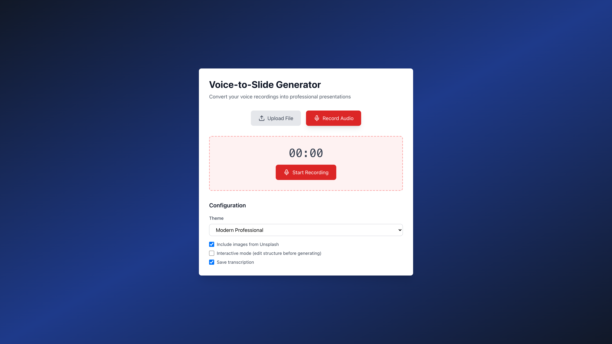
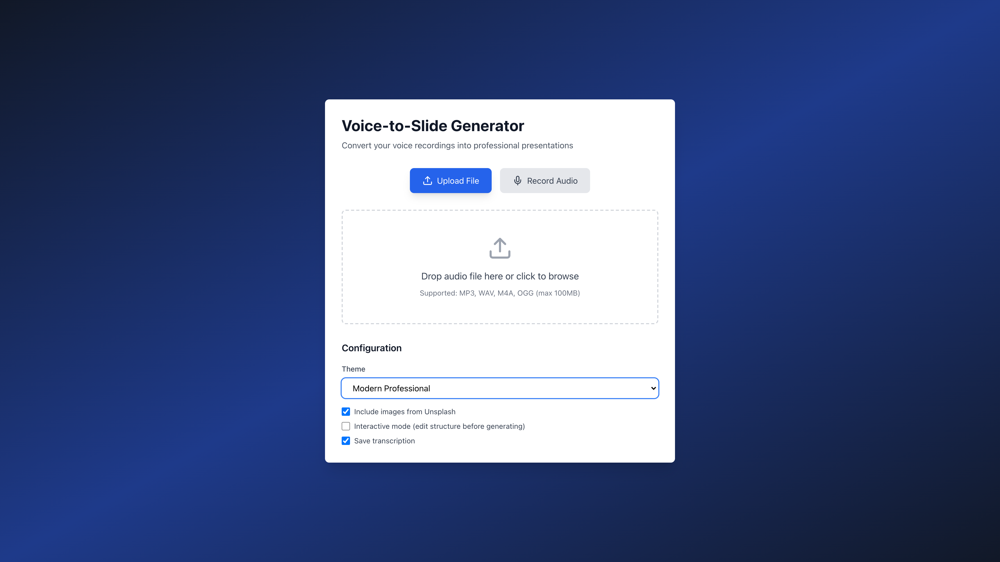
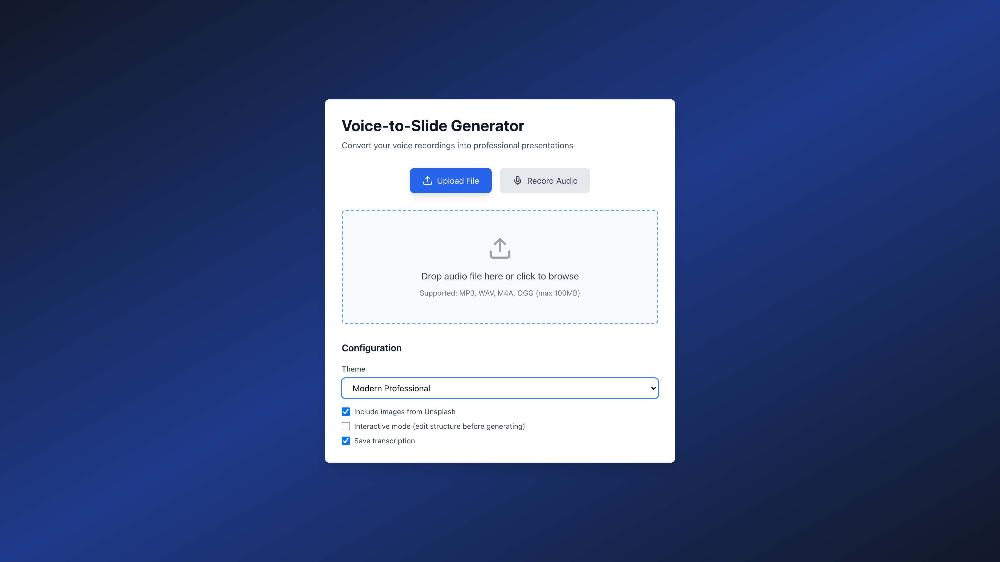

# Voice-to-Slide

Convert voice recordings into professional PowerPoint presentations automatically using AI.

## 🌟 Features

### Web UI (Production Ready)

-   **🎙️ Browser-Based Recording**: Record audio directly in your browser with MediaRecorder API
-   **📤 File Upload**: Drag-and-drop or click to upload audio files (MP3, WAV, M4A, OGG, WebM)
-   **🔄 Dual Input Modes**: Toggle between upload and record modes seamlessly
-   **⚡ Real-time Progress**: WebSocket-based live updates during processing
-   **🎨 Professional Themes**: 5 built-in themes with complete styling control
-   **🖼️ Image Integration**: Automatic image fetching from Unsplash
-   **✏️ Interactive Editing**: Edit presentation structure before generation
-   **🔒 Rate Limiting**: IP-based upload limits for security
-   **📊 Job Tracking**: Monitor transcription, analysis, and generation progress

### Core Features

-   **Audio Transcription**: High-accuracy speech-to-text using Soniox API
-   **AI-Powered Structure Analysis**: Claude AI analyzes transcripts and creates presentation structure using Tool Use
-   **HTML-to-Image Rendering**: Pixel-perfect slide rendering with Playwright
-   **Image Integration**: Relevant images from Unsplash API loaded via CDN
-   **Fast & Cost-Effective**: 70-80% cheaper than cloud-based approaches
-   **Multiple Interfaces**: Both Web UI and CLI available
-   **Modern Python**: Built with uv for blazing-fast dependency management

## 📸 Application Flow (Web UI)

### 1. Landing Page - Upload Mode

Upload audio files via drag-and-drop or file browser.


### 2. Switch to Record Mode

Toggle between upload and record modes with one click.



### 3. Browser-Based Audio Recording

Record audio directly in your browser with start/stop/pause controls.


### 4. Configuration Options

Choose from 5 professional themes, enable images, interactive editing, and save transcription.


### 5. Theme Selection

Select from multiple professional presentation themes.



### 6. Interactive Upload Zone

Responsive drag-and-drop area with hover effects.



## Architecture

### Web Application

-   **Frontend**: React + TypeScript + Vite + Tailwind CSS
-   **Backend**: FastAPI + SQLAlchemy + Celery
-   **Database**: PostgreSQL for job tracking and rate limiting
-   **Cache/Queue**: Redis for Celery broker and WebSocket
-   **Workers**: 3 dedicated Celery queues (transcription, analysis, generation)
-   **Deployment**: Docker Compose with multi-container orchestration

### Generation Strategy

Uses **Strategy B Enhanced: Local Generation with HTML Rendering**

-   Claude Tool Use for intelligent structure analysis (cloud)
-   Claude Messages API for HTML generation with themes
-   Playwright for pixel-perfect HTML-to-image rendering (local)
-   Images loaded from Unsplash CDN during rendering (no caching)
-   Local PPTX assembly with python-pptx

## Prerequisites

### For Web UI (Recommended)

-   Docker and Docker Compose
-   API keys for:
    -   Soniox (audio transcription)
    -   Anthropic Claude (structure analysis)
    -   Unsplash (optional, for images)

### For CLI Only

-   Python 3.10 or higher
-   Same API keys as above

## Quick Start (Web UI)

### 1. Clone and configure

```bash
git clone <repository-url>
cd voice-to-slide
cp .env.example .env
```

Edit `.env` and add your API keys:

```bash
SONIOX_API_KEY=your_soniox_key
CONTENT_ANTHROPIC_API_KEY=your_claude_key
UNSPLASH_ACCESS_KEY=your_unsplash_key
```

### 2. Deploy with Docker

```bash
docker-compose -f docker-compose.yml up -d
```

### 3. Access the application

-   **Web UI**: http://localhost:9002
-   **API**: http://localhost:8002
-   **API Health**: http://localhost:8002/health

### 4. Use the application

1. Open http://localhost:9002 in your browser
2. Choose upload mode or record mode
3. Configure theme and options
4. Upload/record your audio
5. Monitor progress in real-time
6. Download your presentation when ready!

### Stop the application

```bash
docker-compose -f docker-compose.yml down
```

## CLI Installation & Usage

### 1. Install dependencies

```bash
uv sync
```

### 2. Configure API keys

```bash
cp .env.example .env
```

Edit `.env` and add your API keys:

```bash
SONIOX_API_KEY=your_soniox_key
CONTENT_ANTHROPIC_API_KEY=your_claude_key
UNSPLASH_ACCESS_KEY=your_unsplash_key
```

### 3. Verify setup

```bash
uv run voice-to-slide check
```

### 4. Generate presentations

```bash
# Basic usage
uv run voice-to-slide generate recording.mp3

# With custom output path
uv run voice-to-slide generate audio.wav --output my-presentation.pptx

# With specific theme
uv run voice-to-slide generate audio.mp3 --theme "Dark Mode"

# Interactive mode (edit structure before generation)
uv run voice-to-slide generate audio.mp3 --interactive

# Without images
uv run voice-to-slide generate audio.mp3 --no-images
```

### 5. Other commands

```bash
# Transcribe audio only
uv run voice-to-slide transcribe recording.mp3

# Check configuration
uv run voice-to-slide check
```

## How It Works

### Web UI Flow

1. **Audio Input**: User uploads file or records audio in browser
2. **Job Creation**: FastAPI creates job record and queues tasks
3. **Transcription**: Celery worker transcribes audio with Soniox (async)
4. **Structure Analysis**: Claude analyzes transcript and creates slide structure
5. **Interactive Editing** (optional): User edits structure via AI feedback loop
6. **HTML Generation**: Claude generates HTML slides with selected theme
7. **Image Rendering**: Playwright renders HTML to high-quality PNG images
8. **PPTX Assembly**: Images assembled into PowerPoint presentation
9. **WebSocket Updates**: Real-time progress updates to frontend
10. **Download**: User downloads completed presentation

### CLI Flow

1. **Transcription**: Soniox converts audio to text with high accuracy
2. **Structure Analysis**: Claude uses Tool Use to analyze transcript and create presentation structure
3. **Interactive Editing** (optional): AI-powered feedback loop for structure refinement
4. **Preview & Confirm**: User reviews the proposed structure before generation
5. **HTML Generation**: Claude generates HTML slides with selected theme
6. **Image Rendering**: Playwright renders HTML to pixel-perfect images
7. **PPTX Assembly**: python-pptx assembles images into presentation
8. **Output**: A polished PowerPoint file ready to use

## Why This Approach?

**Strategy B Enhanced: Local Generation with HTML Rendering**

-   ✅ **Cost-Effective**: 70-80% cheaper than cloud code execution approaches
-   ✅ **Perfect Quality**: 100% CSS styling preserved via browser rendering
-   ✅ **Professional Themes**: 5 built-in themes with complete styling control
-   ✅ **No Caching**: Images loaded from Unsplash CDN during rendering
-   ✅ **Fast**: Parallel processing with dedicated Celery queues
-   ✅ **Scalable**: Multi-worker architecture for concurrent jobs
-   ✅ **Transparent**: Preview and edit structure before generation
-   ✅ **Flexible**: Both Web UI and CLI interfaces

## Project Structure

```
voice-to-slide/
├── api/                             # FastAPI Backend
│   ├── routers/
│   │   └── generate.py              # Upload & generation endpoints
│   ├── models/
│   │   ├── job.py                   # Job tracking model
│   │   └── rate_limit.py            # Rate limiting model
│   ├── middleware/
│   │   └── rate_limiter.py          # IP-based rate limiting
│   ├── celery_config.py             # Celery task configuration
│   ├── database.py                  # PostgreSQL connection
│   └── main.py                      # FastAPI application
├── frontend/                        # React Frontend
│   ├── src/
│   │   ├── components/
│   │   │   └── AudioRecorder.tsx    # Browser audio recording
│   │   ├── pages/
│   │   │   ├── UploadPage.tsx       # Landing page with dual modes
│   │   │   ├── JobStatusPage.tsx    # Real-time progress tracking
│   │   │   └── EditorPage.tsx       # Interactive structure editor
│   │   ├── api/
│   │   │   └── client.ts            # API + WebSocket client
│   │   └── stores/
│   │       └── configStore.ts       # Configuration state
│   ├── Dockerfile.prod              # Production build
│   └── nginx.conf                   # Nginx configuration
├── src/voice_to_slide/              # CLI & Core Logic
│   ├── main.py                      # CLI interface
│   ├── transcriber.py               # Soniox integration
│   ├── presentation_orchestrator.py # Claude Tool Use orchestration
│   ├── structure_editor.py          # AI-powered feedback loop
│   ├── html_generator.py            # Claude Messages API → HTML
│   ├── html_to_image.py             # Playwright → PNG rendering
│   ├── html_to_pptx.py              # Image → PPTX assembly
│   ├── image_fetcher.py             # Unsplash URL fetching
│   └── utils.py                     # Helper functions
├── docs/
│   ├── screenshots/                 # Application flow screenshots
│   └── development/                 # Implementation reports
├── docker-compose.yml          # Production deployment
├── .env                  # Production environment
└── pyproject.toml                   # Project configuration
```

## 🚀 Deployment

### Production Ports

-   **Frontend**: `http://localhost:9002`
-   **Backend API**: `http://localhost:8002`
-   **Database**: Internal only (not exposed)
-   **Redis**: Internal only (not exposed)

### Rate Limiting

-   **Limit**: 5 uploads per user per 60 minutes
-   **Tracking**: By IP address (supports X-Forwarded-For for proxies)
-   **Response**: HTTP 429 with retry information

### Service Architecture

```
┌─────────────────────────────────────────────────────┐
│                  Docker Network                      │
│  (voice-to-slide-network)                           │
│                                                      │
│  ┌──────────┐      ┌──────────┐                    │
│  │ Frontend │      │   API    │                    │
│  │  :9002   │◄────►│  :8002   │                    │
│  │ (Nginx)  │      │ (FastAPI)│                    │
│  └──────────┘      └─────┬────┘                    │
│                          │                          │
│                    ┌─────┴─────┐                    │
│                    │           │                    │
│              ┌─────▼────┐ ┌───▼────┐               │
│              │PostgreSQL│ │ Redis  │               │
│              │  :5432   │ │ :6379  │               │
│              │(internal)│ │(internal)              │
│              └──────────┘ └────┬───┘               │
│                                │                    │
│              ┌─────────────────┴─────┐             │
│              │                       │             │
│        ┌─────▼──────┐   ┌───────────▼────┐        │
│        │  Worker    │   │    Worker      │        │
│        │Transcription│   │   Analysis    │        │
│        └────────────┘   └────────────────┘        │
│                                                     │
│              ┌─────────────────┐                   │
│              │     Worker      │                   │
│              │   Generation    │                   │
│              │  (Playwright)   │                   │
│              └─────────────────┘                   │
└─────────────────────────────────────────────────────┘
```

### Health Checks

All services include automated health checks:

-   **API**: `curl http://localhost:8002/health`
-   **Frontend**: `curl http://localhost:9002`
-   **Database**: PostgreSQL `pg_isready`
-   **Redis**: `redis-cli ping`

### Monitoring

```bash
# Check service status
docker-compose -f docker-compose.yml ps

# View logs
docker-compose -f docker-compose.yml logs -f api
docker-compose -f docker-compose.yml logs -f worker-transcription
docker-compose -f docker-compose.yml logs -f worker-generation

# Restart services
docker-compose -f docker-compose.yml restart api
```

## 📚 Documentation

-   **[GETTING_STARTED.md](GETTING_STARTED.md)** - Detailed setup guide
-   **[INTERACTIVE_EDITING.md](INTERACTIVE_EDITING.md)** - AI-powered editing guide
-   **[docs/WEB_UI_README.md](docs/WEB_UI_README.md)** - Web UI documentation
-   **[docs/development/](docs/development/)** - Implementation reports
-   **[CLAUDE.md](CLAUDE.md)** - Development guide for Claude Code

## License

MIT License
